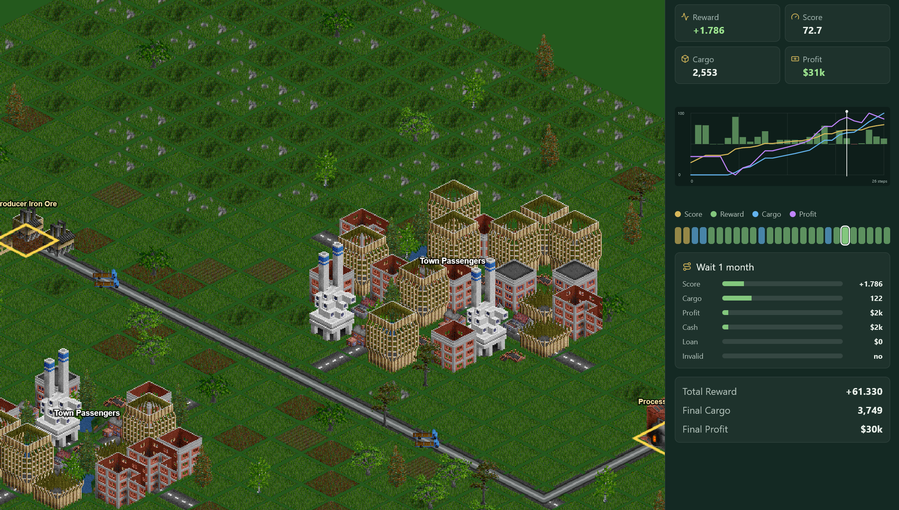

# Tycoon Learning Environment

[](https://github.com/google/jax) [](https://discord.gg/GPwEgANZKX)



Tycoon Learning Environment (TycoonLE) is a reinforcement learning environment for economically grounded, long-horizon planning. Agents operate in a simulated logistics economy where they allocate capital, build transport routes, move cargo, manage debt, and optimize delayed returns.

It is designed to study action legality, candidate-frontier decision interfaces, financing timing, delayed rewards, procedural variation, and replayable audit traces.

TycoonLE uses a fixed-shape interface. Agents choose among valid route, finance, and wait candidates, making rollouts compatible with JAX transformations such as `jit`, `vmap`, and `scan`.

The replay UI makes policies inspectable through route choices, cargo flow, financing behavior, reward, score, and profit over time.

TycoonBench provides a companion benchmark report for comparing agent and model performance on TycoonLE planning tasks: [vrtnis.github.io/tycoonbench](https://vrtnis.github.io/tycoonbench/).

## Install

Use Python 3.11 or 3.12:

```powershell
py -3.12 -m venv .venv
.\.venv\Scripts\python.exe -m pip install -e ".[test]"
npm install
```

## Quickstart

```python
import jax
from tycoonle_jax import TycoonLE

env = TycoonLE(split="dev", family="chain")
state, timestep = env.reset(jax.random.PRNGKey(0))
action = timestep.observation.action_mask.argmax()
state, timestep = env.step(state, action)
```

Export a replay:

```powershell
.\.venv\Scripts\python.exe examples\quickstart.py
npm run dev
```

Open the browser UI and load `runs/quickstart/replay.json`.

Run tests:

```powershell
.\.venv\Scripts\python.exe -m pytest
npm run build
```

## Training

Run a small PPO smoke train:

```powershell
.\.venv\Scripts\python.exe examples\train_ppo_jax.py --updates 1 --num-envs 4 --rollout-length 4 --update-epochs 1 --hidden-sizes 32
```

## Citation

If you find this work useful, consider citing:

```bibtex
@software{tycoonle,
  title = {TycoonLE},
  author = {TycoonLE contributors},
  year = {2026},
  url = {https://github.com/vrtnis/tycoon-learning-environment}
}
```

## Artwork Credits

TycoonLE uses sprite artwork from [OpenGFX](https://github.com/OpenTTD/OpenGFX), an open-source graphics base set for [OpenTTD](https://www.openttd.org/).
